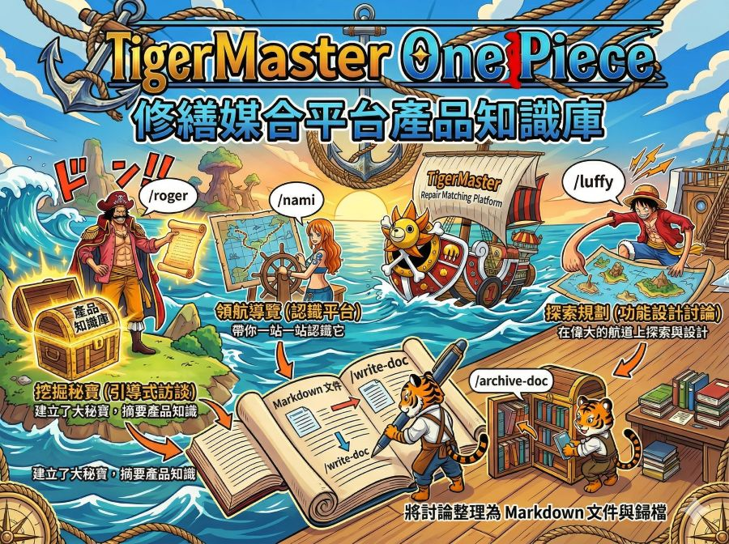

# tigermaster-one-piece

修繕媒合平台的產品知識庫。

將產品功能、營運模式、決策脈絡整理為結構化文件，供團隊透過 AI 輔助理解產品全貌與支援開發決策。

## 知識庫結構

文件分為四層，各自有獨立的 INDEX，詳見 [docs/INDEX.md](docs/INDEX.md)：

```
docs/
├── wiki/          — 產品知識（功能邏輯、業務規則、流程、法規）
├── exploration/   — 設計探索（功能規劃、決策紀錄、原型）
├── design-system/ — 設計系統（tokens、元件規格、複合版型）
└── design-ops/    — 設計團隊自己怎麼運作（檔案維護，其他主題視真實需要才建立）
```

## 開始使用

在此專案目錄下開啟 Claude Code，使用以下指令建立知識內容：

| 指令 | 用途 |
|------|------|
| `/roger` | 引導式訪談，挖掘並摘要產品知識 |
| `/nami` | 產品知識導覽——帶你一站一站認識這個平台 |
| `/luffy` | 引導式設計討論，規劃新功能或優化既有功能 |
| `/sanji` | 設計系統元件主廚，從 Figma 連結、Flutter 程式碼、截圖或口頭描述萃取元件規格 |
| `/robin` | 功能開發完成、或設計方法論定案採用後，把探索文件萃取成知識寫進 `wiki/` 或 `design-ops/`，並留下決策摘要 |
| `/write-doc` | 將討論內容整理成結構化的 Markdown 文件 |
| `/archive-doc` | 將文件歸檔到適當位置，維護 `docs/INDEX.md` |

### 使用流程

**記錄產品知識**：`/roger` → `/write-doc` → `/archive-doc`

**了解產品全貌**：`/nami`

**規劃功能設計**：`/luffy` → `/write-doc` → `/archive-doc`

**建立元件規格**：`/sanji` → `/write-doc` → `/archive-doc`

**功能開發完成**：`/robin`（自動串接 `/write-doc` → `/archive-doc`）

### 設計探索的狀態

`docs/exploration/` 底下先分狀態資料夾，功能資料夾再放在其中：

```
exploration/
├── in-progress/  — 設計或開發還沒結束，或已上線／已採用但知識還沒整理進知識庫
├── completed/    — 已上線／已採用且 /robin 整理過，資料夾內留有 decision-summary.md
└── on-hold/      — 暫停或決定不做，文件保留供日後參考
```

功能開發完成、或設計方法論定案採用後執行 `/robin`：她會把關鍵知識萃取進 `wiki/` 或 `design-ops/`、在資料夾內留下 `decision-summary.md`，再把整個資料夾搬進 `completed/`。原始探索文件不刪不改——目的地文件記錄「現在怎麼運作／怎麼做」，探索文件記錄「當初為什麼這樣決定」。

想到要寫的主題，記錄在根目錄的 `BACKLOG.md`。文件中的待釐清事項（TBD）使用 `- [ ]` checkbox 格式，搭配 VSCode [Todo Tree](https://marketplace.visualstudio.com/items?itemName=Gruntfuggly.todo-tree) 插件可快速瀏覽全專案的待辦項目。

（以航海王為命名主軸：`/roger` 建立了大秘寶，`/nami` 帶路領航，`/luffy` 在偉大的航道上探索它，`/sanji` 掌廚打理細節，`/robin` 則作為考古學家，把航行留下的線索解讀成能傳世的歷史本文。專案名稱 tigermaster-one-piece 亦源於此。）
