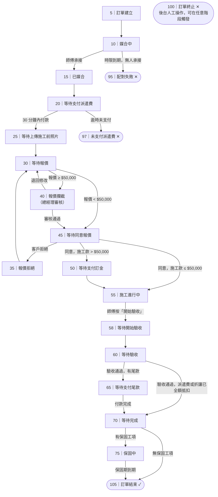

# 訂單生命週期

## 概述

本文件為訂單完整生命週期的主幹，以狀態碼為骨架記錄每個階段的意義與轉換條件。各環節的詳細流程見對應的細節文件。

---

## 訂單狀態碼對照表

| 狀態碼 | 名稱 | 說明 |
|--------|------|------|
| 5 | 訂單建立 | 客戶完成叫修資訊填寫，訂單成立 |
| 10 | 媒合中 | 系統向符合條件的師傅推送案件，等待承接 |
| 15 | 已媒合 | 師傅搶先承接，等待客戶支付派遣費 |
| 20 | 等待支付派遣費 | 客戶須於 30 分鐘內以信用卡支付派遣費 |
| 22 | 等待商品運送 | 業務上未使用 |
| 25 | 等待上傳施工前照片 | 派遣費支付成功，師傅前往現場場勘並上傳施工前照片 |
| 30 | 等待報價 | 師傅完成場勘，填寫並提交報價單 |
| 35 | 報價拒絕 | 客戶拒絕報價，退回師傅修改重送 |
| 40 | 報價攔截 | 報價金額 ≥ $50,000，進入總經理審核；審核通過後進入狀態 45，否則退回師傅修改 |
| 45 | 等待同意報價 | 報價通過審核，等待客戶審閱同意或拒絕 |
| 50 | 等待支付訂金 | 施工款超過 $50,000 時，客戶須先支付三成訂金後才可進入施工 |
| 55 | 業主已於系統上同意報價單 | 客戶同意報價，訂單進入施工進行中；師傅 App 顯示「等待上傳施工照片」 |
| 58 | 等待開始驗收 | 師傅施工完成並按下「開始驗收」，系統推送通知給客戶 |
| 60 | 等待驗收 | 客戶收到驗收通知，選擇驗收方式確認成果 |
| 65 | 等待支付尾款 | 客戶驗收通過，支付尾款（信用卡或 ATM 匯款） |
| 70 | 等待完成 | 尾款支付完成（或派遣費、折讓已全額抵扣），系統計算保固期限，準備推進訂單狀態 |
| 75 | 保固中 | 有保固的工項進入此狀態，顯示保固期限；客戶可申請售後服務 |
| 80 | 退款中 | 業務上未實際使用 |
| 90 | 出保 | 業務上未實際使用；訂單直接從「保固中（75）」推進至「訂單結束（105）」 |
| 95 | 配對失敗 | 媒合截止時限到期，無師傅承接，訂單自動關閉 |
| 97 | 未支付派遣費 | 客戶未於 30 分鐘內支付派遣費，訂單取消 |
| 100 | 訂單終止 | 後台人工執行「關閉訂單」操作；可在訂單任意階段觸發，屬非正常結束 |
| 105 | 訂單結束 | 訂單正常走完整個流程後的最終狀態 |

---

## 正常流程概覽

---

## 各階段細節文件

| 階段 | 狀態碼範圍 | 文件 |
|------|-----------|------|
| 媒合流程與派遣費 | 5 → 25 | [matching-flow.md](matching-flow.md) |
| 場勘 | 25 → 30 | [site-inspection.md](site-inspection.md) |
| 報價 | 30 → 55 | [quotation-flow.md](quotation-flow.md) |
| 施工 | 55 → 58 | [construction-flow.md](construction-flow.md) |
| 驗收與付款 | 58 → 70 | [completion-flow.md](completion-flow.md) |
| 評價與小費 | 完工後 | [rating-and-tip.md](rating-and-tip.md) |
| 保固與售後 | 70 → 105 | [warranty-flow.md](warranty-flow.md) |
| 費用總覽（客戶端） | — | [customer-payment.md](../business/customer-payment.md) |
